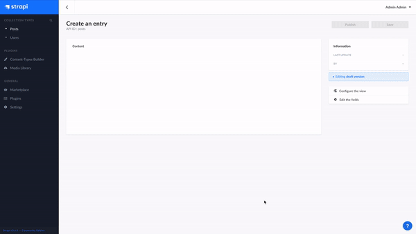

# 🎛 Strapi + ✒️ Editor.js
> ### Plugin for Strapi Headless CMS, hiding the standard WYSIWYG editor on Editor.js



#
## 🍀 Supported official add-ons

- [x] Paragraph Tool (default)
- [x] [Embed Tool](https://github.com/editor-js/embed)
- [x] [Table tool](https://github.com/editor-js/table)
- [x] [List Tool](https://github.com/editor-js/list)
- [x] [Warning Tool](https://github.com/editor-js/warning)
- [x] [Code Tool](https://github.com/editor-js/code)
- [x] [Link Tool](https://github.com/editor-js/link)
- [x] [Image Tool](https://github.com/editor-js/image)
- [x] [Raw HTML Tool](https://github.com/editor-js/raw)
- [x] [Heading Tool](https://github.com/editor-js/header)
- [x] [Quote Tool](https://github.com/editor-js/quote)
- [x] [Marker Tool](https://github.com/editor-js/marker)
- [x] [Checklist Tool](https://github.com/editor-js/checklist)
- [x] [Delimiter Tool](https://github.com/editor-js/delimiter)
- [x] [InlineCode Tool](https://github.com/editor-js/inline-code)
- [ ] [Personality Tool](https://github.com/editor-js/personality)
- [ ] [Attaches Tool](https://github.com/editor-js/attaches)

#### All of the above add-ons (if added) work initially when the plugin is loaded. You can also customize the add-ons available in your application using the instructions below.

>  Note: the Image add-on cannot be reconfigured by you personally, this is due to some problems with the work of this add-on. You just better leave it alone.
#
## 🤟🏻 Getting Started
```bash
yarn add strapi-plugin-react-editorjs
# or
npm install strapi-plugin-react-editorjs
```
For the plugin to work correctly, you need to give public and Authenticated role access to the plugin API, at the moment it is necessary for:
1. [Link Tool](https://github.com/editor-js/link)
2. [Image Tool](https://github.com/editor-js/image)
#
## 🛠 Need Help

1. [Image Tool](https://github.com/editor-js/image)

🚸 At the moment I do not have time to correctly implement the image loading module, you can see how it is implemented now and understand what the problem is. If you are ready to help me, then I am ready to explain and tell you what and how.
#
## 👨🏻‍🏭 In developing

1. [Personality Tool](https://github.com/editor-js/personality)
2. [Attaches Tool](https://github.com/editor-js/attaches)

🧐 These plugins will soon be officially supported, there will be a little wait.
#
## ⭐️ Show your support

Give a star if this project helped you.